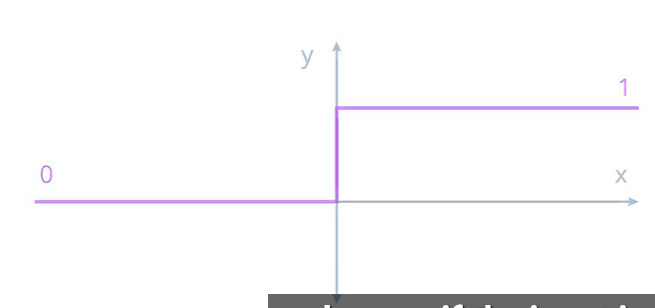
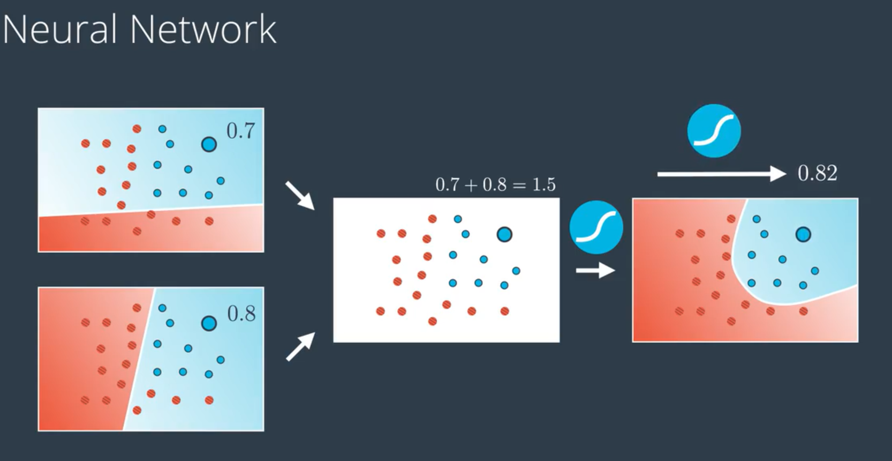
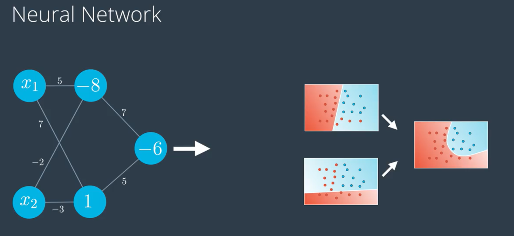
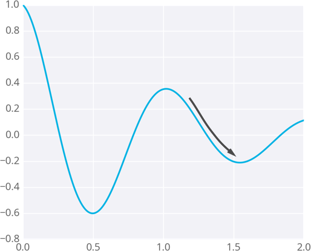
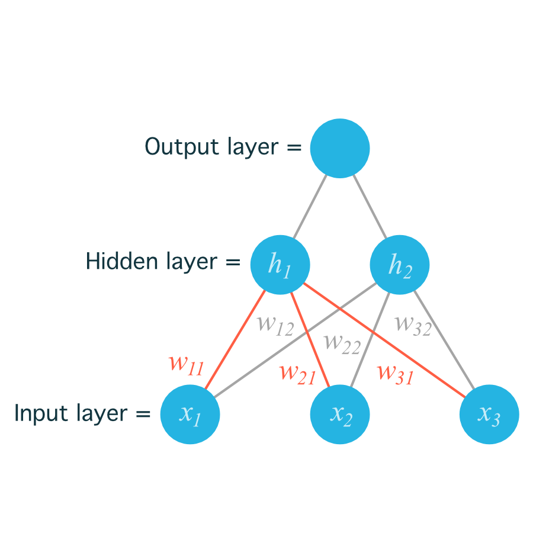
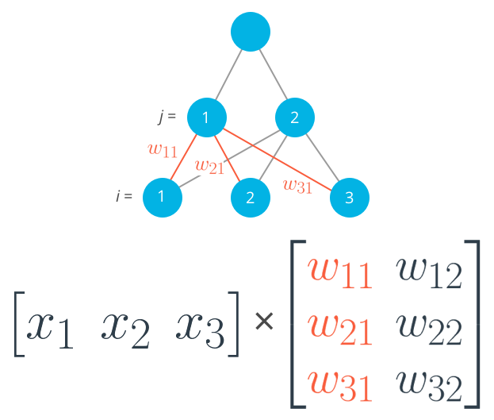
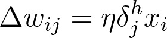
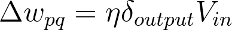
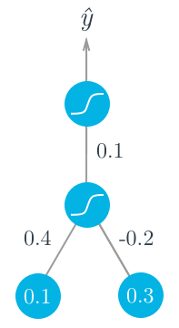
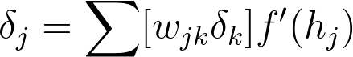

[TOC]

## 二、深度学习

### （一）深度学习简介：

深度学习最重要的组成部分为：Neural Networks（神经网络）------*模仿大脑操作过程，并通过神经元发射零零散散的信息。*

#### 1. 感知器（perceptron）：

**指的是把方程式进行编码，形成小图形。**


##### （1）阶跃函数（step function）：




#### 2. 感知器算法：    


感知器步骤如下所示：

对于坐标轴为 $(p,q)$ 的点，标签 $y$，以及等式$ \hat{y} = step(w_1x_1 + w_2x_2 + b)$给出的预测：

- 如果点分类正确，则什么也不做。
- 如果点分类为**正**，但是标签为**负**，则分别减去$ \alpha p, \alpha q$, 和 $\alpha$ 至 $w_1, w_2$, 和 $b$.
- 如果点分类为**负**，但是标签为**正**，则分别将$ \alpha p, \alpha q$,和 $\alpha$ 加到 $w_1, w_2$,和 $b$ 上。

```python
import numpy as np
# Setting the random seed, feel free to change it and see different solutions.
np.random.seed(22)

def stepFunction(t):
    if t >= 0:
        return 1
    return 0

def prediction(X, W, b):
    #np.matmul()：两个矩阵相乘。Matrix product of two arrays
    return stepFunction((np.matmul(X,W)+b)[0])

# TODO: Fill in the code below to implement the perceptron trick.
# The function should receive as inputs the data X, the labels y,
# the weights W (as an array), and the bias b,
# update the weights and bias W, b, according to the perceptron algorithm,
# and return W and b.
def perceptronStep(X, y, W, b, learn_rate = 0.01):
    # Fill in code
    for i in range(len(X)):
        y_hat = prediction(X[i], W, b)
        if y_hat != y[i]:
            if y_hat == 1:
                W[0] = W[0] - learn_rate * X[i][0]
                W[1] = W[1] - learn_rate * X[i][1]
                b = b - learn_rate
            elif y_hat == 0:
                W[0] = W[0] + learn_rate * X[i][0]
                W[1] = W[1] + learn_rate * X[i][1]
                b = b + learn_rate
        else:
            pass
    return W, b

# This function runs the perceptron algorithm repeatedly on the dataset,
# and returns a few of the boundary lines obtained in the iterations,
# for plotting purposes.
# Feel free to play with the learning rate and the num_epochs,
# and see your results plotted below.
def trainPerceptronAlgorithm(X, y, learn_rate = 0.01, num_epochs = 25):
    x_min, x_max = min(X.T[0]), max(X.T[0])
    y_min, y_max = min(X.T[1]), max(X.T[1])
    #设置初始权重和偏差
    W = np.array(np.random.rand(2,1))
    b = np.random.rand(1)[0] + x_max
    # These are the solution lines that get plotted below.
    boundary_lines = []
    for i in range(num_epochs):
        # In each epoch, we apply the perceptron step.
        W, b = perceptronStep(X, y, W, b, learn_rate)
        boundary_lines.append((-W[0]/W[1], -b/W[1]))
    return boundary_lines

```

```csv
0.78051,-0.063669,1
0.28774,0.29139,1
0.40714,0.17878,1
0.2923,0.4217,1
0.50922,0.35256,1
0.27785,0.10802,1
0.27527,0.33223,1
0.43999,0.31245,1
0.33557,0.42984,1
0.23448,0.24986,1
0.0084492,0.13658,1
0.12419,0.33595,1
0.25644,0.42624,1
0.4591,0.40426,1
0.44547,0.45117,1
0.42218,0.20118,1
0.49563,0.21445,1
0.30848,0.24306,1
0.39707,0.44438,1
0.32945,0.39217,1
0.40739,0.40271,1
0.3106,0.50702,1
0.49638,0.45384,1
0.10073,0.32053,1
0.69907,0.37307,1
0.29767,0.69648,1
0.15099,0.57341,1
0.16427,0.27759,1
0.33259,0.055964,1
0.53741,0.28637,1
0.19503,0.36879,1
0.40278,0.035148,1
0.21296,0.55169,1
0.48447,0.56991,1
0.25476,0.34596,1
0.21726,0.28641,1
0.67078,0.46538,1
0.3815,0.4622,1
0.53838,0.32774,1
0.4849,0.26071,1
0.37095,0.38809,1
0.54527,0.63911,1
0.32149,0.12007,1
0.42216,0.61666,1
0.10194,0.060408,1
0.15254,0.2168,1
0.45558,0.43769,1
0.28488,0.52142,1
0.27633,0.21264,1
0.39748,0.31902,1
0.5533,1,0
0.44274,0.59205,0
0.85176,0.6612,0
0.60436,0.86605,0
0.68243,0.48301,0
1,0.76815,0
0.72989,0.8107,0
0.67377,0.77975,0
0.78761,0.58177,0
0.71442,0.7668,0
0.49379,0.54226,0
0.78974,0.74233,0
0.67905,0.60921,0
0.6642,0.72519,0
0.79396,0.56789,0
0.70758,0.76022,0
0.59421,0.61857,0
0.49364,0.56224,0
0.77707,0.35025,0
0.79785,0.76921,0
0.70876,0.96764,0
0.69176,0.60865,0
0.66408,0.92075,0
0.65973,0.66666,0
0.64574,0.56845,0
0.89639,0.7085,0
0.85476,0.63167,0
0.62091,0.80424,0
0.79057,0.56108,0
0.58935,0.71582,0
0.56846,0.7406,0
0.65912,0.71548,0
0.70938,0.74041,0
0.59154,0.62927,0
0.45829,0.4641,0
0.79982,0.74847,0
0.60974,0.54757,0
0.68127,0.86985,0
0.76694,0.64736,0
0.69048,0.83058,0
0.68122,0.96541,0
0.73229,0.64245,0
0.76145,0.60138,0
0.58985,0.86955,0
0.73145,0.74516,0
0.77029,0.7014,0
0.73156,0.71782,0
0.44556,0.57991,0
0.85275,0.85987,0
0.51912,0.62359,0
```

#### 3. 误差函数（Error function）与梯度下降：    

误差函数提供给我们的预测值与实际值之间的差异，但是这个差异如何指导我们权重的更新呢？我们的目标是找到**最小**的误差函数值来找到与实际值误差最小的预测值。

在简单的线性方程中，我们可以通过判断“预测值与实测值相比是大了还是小了”来决定权重是增加还是减少。但是在更为复杂的非线性环境中呢？复杂的数学问题，我们就直接来看看学者们的解决策略。

假设一维问题是一条直线，那么二维问题就是一个平面，而三维问题就是一个曲面。曲面可以理解为有山峰也有低谷的地面，误差最小的地方就是低谷处，我们希望计算机找到的就是这个低谷的值。为了找到这个低谷，学者们发明了**梯度下降**。

> 用数学术语描述，为了进行梯度下降，误差函数（error function）不能是离散的，必须是连续的。因为位置上的轻微变化就会导致高度发生变化。**误差函数必须是可微分的。**

#### 4. 离散型与连续性预测：

对于优化而言，连续型误差函数比离散型函数（只有1或0输出来表示分类）更好。为此，我们需要从离散型预测变成连续型预测。


* **概率是关于点离直线距离的函数。**


 

#### 5. 多类别分类和Softmax：   

* **Softmax函数**：是激活函数的对等形式。它和s型函数是对等的，但是问题具有3个或更多个类别。


* Softmax Function:

  * 假如有n个类别和线性模型，可以得到下列分数：

  

  **答案为是的。**

  * 编写$Softmax$函数：

  ```python
  '''
  方法一
  '''
  import numpy as np
  
  # Write a function that takes as input a list of numbers, and returns
  # the list of values given by the softmax function.
  def softmax(L):
      sum_L = sum(np.exp(L))
      # print(sum_L)
      return np.exp(L) / sum_L
  
  '''
  方法二
  '''
  import numpy as np
  
  def softmax(L):
      expL = np.exp(L)
      sumExpL = sum(expL)
      result = []
      for i in expL:
          result.append(i*1.0/sumExpL)
      return result
      
      # Note: The function np.divide can also be used here, as follows:
      # def softmax(L):
      #     expL = np.exp(L)
      #     return np.divide (expL, expL.sum())
  
  ```

  

#### 6. One-Hot 编码：

计算机在表示多结果的分类时，使用One-Hot编码是比较常见的处理方式。

#### 7. 最大似然率（maximum Likelihood）：

> 最佳模型更有可能是对于实际在我们身上发生情况所对应的概率更大的模型。

##### （1）最大化概率（maximum probability）：

**等价于最小化误差函数。**

#### 8. 交叉熵（Cross Entropy）---损失函数：

* 可以看作是概率和误差函数之间的联系。

* 特性：

  * 如果有一系列的事件及其对应的发生概率，根据这些概率，这些事件发生的可能性有多大？
    * 如果可能性大，则交叉熵较小。
    * 如果可能性小，那么交叉熵就会很大。

  

* **准确的模型可以得到较低的交叉熵，误差较大的模型得到的交叉熵较高。**

* 可以将每个数据点的交叉熵作为该点的误差。

* **目标可以从最大化概率转变为最小化交叉熵。**


```python
'''
方法一
'''
import numpy as np

# Write a function that takes as input two lists Y, P,
# and returns the float corresponding to their cross-entropy.
def cross_entropy(Y, P):
    result = 0
    for i in range(len(Y)):
        result += Y[i] * np.log(P[i]) + (1-Y[i]) * np.log(1-P[i])

    return -result


'''
方法二
'''
import numpy as np

def cross_entropy(Y, P):
    Y = np.float_(Y)
    P = np.float_(P)
    return -np.sum(Y * np.log(P) + (1 - Y) * np.log(1 - P))
```

##### （1） 多类别交叉熵：     

* 交叉熵与结果的总概率成反比。

#### 9. logistic 回归： 

**对数几率回归**算法。基本上是这样的：

- 获得数据
- 选择一个随机模型
- 计算误差
- 最小化误差，获得更好的模型
- 完成！

##### （1） 计算误差函数：


> 上图中，m是样本个数，n是类别个数。

##### （2） 最小化误差函数：

**主要使用梯度下降法。**      

#### 10. 梯度下降：     

* 误差函数$E$的梯度为相对于权重$W$偏导数的矢量和。
* 这个梯度实际上就是*误差函数增长最快的方向*。该梯度的反方向则是误差函数降低最快的方向。

#### 11. 梯度计算：

为了最小化误差函数，就需要获得一些导数。我们开始计算误差函数的导数吧。

首先要注意的是$S$型函数具有很完美的导数。即

$$\sigma'(x) = \sigma(x) (1-\sigma(x))$$

原因是，我们可以使用商式计算它：

[]()


现在，如果有 *m* 个样本点，标为 $x^{(1)}, x^{(2)}, \ldots, x^{(m)}$ 误差公式是：

$$E = -\frac{1}{m} \sum_{i=1}^m \left( y^{(i)} \ln(\hat{y^{(i)}}) + (1-y^{(i)}) \ln (1-\hat{y^{(i)}}) \right)$$

预测是 $\hat{y^{(i)}} = \sigma(Wx^{(i)} + b).$

我们的目标是计算$E$在单个样本点$x$处的梯度（偏导数），其中 $x$ 包含 $n$ 个特征，即$x = (x_1, \ldots, x_n)$。

$$\nabla E =\left(\frac{\partial}{\partial w_1}E, \cdots, \frac{\partial}{\partial w_n}E, \frac{\partial}{\partial b}E \right)$$

为此，首先我们要计算$\frac{\partial}{\partial w_j} \hat{y}$.

因为这是上述公式里的第一个元素。

因为$\hat{y} = \sigma(Wx+b)$, 因此：

[](https://classroom.udacity.com/nanodegrees/nd025-cn/parts/fecc645f-8b1f-4d73-9754-7b7b380f01e8/modules/afa2a1d2-faba-4f05-a5e3-2759e1336e91/lessons/00912248-2445-4713-ad9c-76b8536e1959/concepts/0d92455b-2fa0-4eb8-ae5d-07c7834b8a56#)

最后一个等式是因为和中的唯一非常量项相对于 $w_j$ 正好是 $w_j x_j$, 明显具有导数 $x_j.$

现在可以计算 $\frac {\partial} {\partial w_j}E$

[](https://classroom.udacity.com/nanodegrees/nd025-cn/parts/fecc645f-8b1f-4d73-9754-7b7b380f01e8/modules/afa2a1d2-faba-4f05-a5e3-2759e1336e91/lessons/00912248-2445-4713-ad9c-76b8536e1959/concepts/0d92455b-2fa0-4eb8-ae5d-07c7834b8a56#)

类似的计算将得出：（备注：下图公式其为 m 个样本点时的公式）

【针对单个样本点时，$E$ 对 $b$ 求偏导的公式为：$\frac {\partial} {\partial b} E=-(y -\hat{y})$】

[](https://classroom.udacity.com/nanodegrees/nd025-cn/parts/fecc645f-8b1f-4d73-9754-7b7b380f01e8/modules/afa2a1d2-faba-4f05-a5e3-2759e1336e91/lessons/00912248-2445-4713-ad9c-76b8536e1959/concepts/0d92455b-2fa0-4eb8-ae5d-07c7834b8a56#)

这个实际上告诉了我们很重要的规则:

**对于具有坐标$ (x_1, \ldots, x_n)$, 的点，标签 $y$, 预测 $\hat{y}$, 该点的误差函数梯度是 $\left(-(y - \hat{y})x_1, \cdots, -(y - \hat{y})x_n, -(y - \hat{y}) \right)$.**

总之

$$\nabla E(W,b) = -(y - \hat{y}) (x_1, \ldots, x_n, 1).$$

如果思考下，会发现很神奇。**梯度实际上是标量乘以点的坐标**！什么是标量？也就是标签和预测之间的差别。这意味着，如果标签与预测接近（表示点分类正确），该梯度将很小，如果标签与预测差别很大（表示点分类错误），那么此梯度将很大。请记下：**小的梯度表示我们将稍微修改下坐标，大的梯度表示我们将大幅度修改坐标。**

##### (1) 梯度下降步骤

因此，梯度下降的简单步骤包括**权重减去每点的误差函数的梯度与学习速率的乘积**，然后按以下方式更新权重：

$$w_i' \leftarrow w_i -\alpha [-(y - \hat{y}) x_i]$$

这相当于

$$w_i' \leftarrow w_i + \alpha (y - \hat{y}) x_i$$

类似地，它以如下方式更新偏差：

$$b' \leftarrow b + \alpha (y - \hat{y})$$

> **注意：**因为我们取了这些误差的平均值，我们要添加的这项应该是 $\frac{1}{m} \cdot \alpha$而不是 $\alpha$，但因为$\alpha$是一个常量，为简化计算，我们仅取 $\frac{1}{m} \cdot \alpha$ 作为学习速率并且用这个符号来表示 $\alpha.$

##### （2） 感知器和梯度下降：


#### 12. 神经网络结构：  

##### （1） 神经网络架构：

* 可以将多个线性模型进行组合就可以得到非线性模型。



* 也可以对不同的模型赋予不同的权重组合得到新的非线性模型。*上图中最右边的模型可以看作是两个之前的线性模型的线性组合。也可以看作是两个模型之间的一条曲线。*-----》**构建神经网络的核心。**




* 输入层：单个样本的所有特征$x_i$。
* 隐藏层：针对输入层输入的一系列线性模型。
* 输出层：多个线性模型组合成的一个非线性模型。

> 输入层有$n$个节点，那么处理的就是$n$维空间的数据。

#### 13. 前向反馈（`FeedForwardS`）：

##### (1) 前向反馈：

* 前向反馈是神经网络用来**将输入变成输出**的流程。


#### 14. 误差函数：


#### 15. 反向传播(Backpropagation）：

准备好训练神经网络了。为此，我们将使用一种方法，叫做**反向传播**。简而言之，反向传播将包括：

- 进行前向反馈运算。
- 将模型的输出与期望的输出进行比较。
- 计算误差。
- 向后运行前向反馈运算（反向传播），将误差分散到每个权重上。
- 更新权重，并获得更好的模型。
- 继续此流程，直到获得很好的模型。


#### 16. 链式法则（Chain Rule）：


* A： $x$为函数$f$的变量。
* B： $f(x)$为$g$的变量。
* 链式法则证明：$B$关于$x$的偏导数就是$B$关于$A$的偏导数乘以$A$关于$x$的偏导数
* **对复合函数求导，就是一系列导数的乘积。**


#### 17. 计算 sigmoid 函数的导数：

回想一下，sigmoid 函数有一个完美的导数，我们可以在下面的计算中看到。这将使我们的反向传播步骤更加简洁。


### （二）实现梯度下降：

#### 1. 误差：

##### (1) 均方误差和sum of the squared errors (SSE):

$$E = \frac{1}{2}\sum_\mu\sum_j[y^\mu_j-\hat{y}^\mu_j]^2$$

* 这里 $\hat y$ 是预测值， $y$ 是真实值。
* 一个是所有输出单元$j$ 的和，另一个是所有数据点 $\mu$ 的和。

1. 首先是内部这个对 $j$ 的求和。变量 $j$ 代表网络输出单元。所以这个内部的求和是指对于**每一个输出单元，计算预测值 $\hat y$ 与真实值 $y$之间的差的平方，再求和。**

2. 另一个对 $\mu$ 的求和是针对所有的数据点。也就是说，**对每一个数据点，计算其对应输出单元的方差和，然后把每个数据点的方差和加在一起。**

3. **SSE 是一个很好的选择有几个原因：误差的平方总是正的，对大误差的惩罚大于小误差。**

4. 回想神经网络的输出，也就是预测值，取决于权重：

$$\hat{y}^{\mu}_j = f \left( \sum_i{ w_{ij} x^{\mu}_i }\right)$$

相应的，误差也取决于权重：

$$E = \frac{1}{2}\sum_\mu \sum_j \left[ y^{\mu}_j - f \left( \sum_i{ w_{ij} x^{\mu}_i }\right) \right]^2$$

5. 我们想让网络预测的误差尽可能小，权重是让我们能够实现这个目标的调节旋钮。我们的目的是寻找权重 $w_{ij}$使得误差平方 E最小。

通常来说神经网络通过**梯度下降**来实现这一点。

* **梯度**是改变率或者斜度的另一个称呼。
* 梯度就是对多变量函数导数的泛化。
* *如果权重初始值有错，梯度下降可能会使得权重陷入局部最优。*




#### 2. 梯度下降：代码：

之前我们看到一个权重的更新可以这样计算：

$$\Delta w_i = \eta \, \delta x_i$$

这里 $error\_term: \delta$ 是指

$$\delta = (y - \hat y) f'(h) = (y - \hat y) f'(\sum w_i x_i)$$

记住，上面公式中 $(y - \hat y)$ 是**输出误差**，激活函数 $f(h)$ 的导函数是$f'(h)$ ，我们把这个导函数称做**输出的梯度**。

现在假设只有一个输出单元，代码如下。依旧使用 $sigmoid$ 来作为激活函数 $f(h)$。

```python
# Defining the sigmoid function for activations 
# 定义 sigmoid 激活函数
def sigmoid(x):
    return 1/(1+np.exp(-x))

# Derivative of the sigmoid function
# 激活函数的导数
def sigmoid_prime(x):
    return sigmoid(x) * (1 - sigmoid(x))

# Input data
# 输入数据
x = np.array([0.1, 0.3])
# Target
# 目标
y = 0.2
# Input to output weights
# 输入到输出的权重
weights = np.array([-0.8, 0.5])

# The learning rate, eta in the weight step equation
# 权重更新的学习率
learnrate = 0.5

# the linear combination performed by the node (h in f(h) and f'(h))
# 输入和权重的线性组合
h = x[0]*weights[0] + x[1]*weights[1]
# or h = np.dot(x, weights)

# The neural network output (y-hat)
# 神经网络输出
nn_output = sigmoid(h)

# output error (y - y-hat)
# 输出误差
error = y - nn_output

# output gradient (f'(h))
# 输出梯度
output_grad = sigmoid_prime(h)

# error term (lowercase delta)
# 误差项
error_term = error * output_grad

# Gradient descent step 
# 梯度下降一步
del_w = [ learnrate * error_term * x[0],
          learnrate * error_term * x[1]]
# or del_w = learnrate * error_term * x
```

```python
import numpy as np

def sigmoid(x):
    """
    Calculate sigmoid
    """
    return 1/(1+np.exp(-x))

def sigmoid_prime(x):
    """
    # Derivative of the sigmoid function
    """
    return sigmoid(x) * (1 - sigmoid(x))

learnrate = 0.5
x = np.array([1, 2, 3, 4])
y = np.array(0.5)

# Initial weights
w = np.array([0.5, -0.5, 0.3, 0.1])

### Calculate one gradient descent step for each weight
### Note: Some steps have been consolidated, so there are
###       fewer variable names than in the above sample code

# TODO: Calculate the node's linear combination of inputs and weights
# 输入和权重的线性组合
h = np.dot(x, w)

# TODO: Calculate output of neural network
# 输出项
nn_output = sigmoid(h)

# TODO: Calculate error of neural network
# 输出误差
error = y - nn_output

# TODO: Calculate the error term
#       Remember, this requires the output gradient, which we haven't
#       specifically added a variable for.
#  误差项：输出误差乘以输出的梯度
error_term = error * sigmoid_prime(h)

# TODO: Calculate change in weights
# 权重改变项：学习速率*误差项*样本
del_w = learnrate * error_term * x

print('Neural Network output:')
print(nn_output)
print('Amount of Error:')
print(error)
print('Change in Weights:')
print(del_w)
```


#### 3. 实现梯度下降：

1. 更新权重：

$$\Delta w_{ij} = \eta * \delta_j * x_i$$

2. **均方差（mean of the square errors，MSE）**：误差平方的均值。


3. 梯度下降来更新权重的算法概述：

- 权重步长设定为 0： $\Delta w_i = 0$
- 对训练数据中的每一条记录：
  - 通过网络做正向传播，计算输出 $\hat y = f(\sum_i w_i x_i)$
  - 计算输出单元的误差项（error term）**输出误差**： $\delta = (y - \hat y)$
  - 更新权重步长 $\Delta w_i = \Delta w_i + \delta x_i$
- 更新权重 $w_i = w_i + \frac{\eta \Delta w_i }{m}$。其中 $\eta$是学习率， $m$ 是数据点个数。这里我们对权重步长做了平均，为的是降低训练数据中大的变化。
- 重复 $e$ 代（epoch）。

这里我们还是使用 sigmoid 作为激活函数

$$f(h) = 1/(1+e^{-h})$$

sigmoid 的梯度是： $$f'(h) = f(h) (1 - f(h))$$

其中 $h$ 是输出单元的输入

$$h = \sum_i w_i x_i$$

#### 4. 使用numpy来实现代码：

1. 初始化权重：初始化的权重需要比较小的值，这样输入在 sigmoid 函数那里可以在接近 0 的位置，而不是最高或者最低处。并且要随机地初始化它们，这样它们有不同的初始值，是发散且不对称的。**所以可以用一个中心为 0 的正态分布来初始化权重，此正态分布的标准差（scale 参数）最好使用 $1/\sqrt{n}$，其中 $n$ 是输入单元的个数**。这样就算是输入单元的数量变多，sigmoid 的输入还能保持比较小。

   ```python
   weights = np.random.normal(scale=1/n_features**.5, size=n_features)
   ```

   ```python
   # input to the output layer
   # 输出层的输入
   output_in = np.dot(weights, inputs)
   ```

2. gradient.py

```python
import numpy as np
from data_prep import features, targets, features_test, targets_test


def sigmoid(x):
    """
    Calculate sigmoid
    """
    return 1 / (1 + np.exp(-x))

# TODO: We haven't provided the sigmoid_prime function like we did in
#       the previous lesson to encourage you to come up with a more
#       efficient solution. If you need a hint, check out the comments
#       in solution.py from the previous lecture.

# Use to same seed to make debugging easier
np.random.seed(42)

n_records, n_features = features.shape
last_loss = None

# Initialize weights
# 初始化权重服从标准差scale为1 / n_features**.5，中心为0的正态分布
weights = np.random.normal(scale=1 / n_features**.5, size=n_features)

# Neural Network hyperparameters
epochs = 1000
learnrate = 0.5

for e in range(epochs):
    #权重步长初始化为0
    del_w = np.zeros(weights.shape)
    #对每一个数据样本进行计算
    for x, y in zip(features.values, targets):
        # Loop through all records, x is the input, y is the target

        # Note: We haven't included the h variable from the previous
        #       lesson. You can add it if you want, or you can calculate
        #       the h together with the output

        # TODO: Calculate the output
        # 计算输出y_hat
        output = sigmoid(np.dot(weights, x))

        # TODO: Calculate the error
        # 计算输出误差
        error = y - output

        # TODO: Calculate the error term
        # 计算误差项
        error_term = error * output * (1-output)

        # TODO: Calculate the change in weights for this sample
        #       and add it to the total weight change
        # 更新权重步长
        del_w += error_term * x

    # TODO: Update weights using the learning rate and the average change in weights
    # 更新权重
    weights += learnrate * del_w / n_records

    # Printing out the mean square error on the training set
    if e % (epochs / 10) == 0:
        out = sigmoid(np.dot(features, weights))
        loss = np.mean((out - targets) ** 2)
        if last_loss and last_loss < loss:
            print("Train loss: ", loss, "  WARNING - Loss Increasing")
        else:
            print("Train loss: ", loss)
        last_loss = loss


# Calculate accuracy on test data
tes_out = sigmoid(np.dot(features_test, weights))
predictions = tes_out > 0.5
accuracy = np.mean(predictions == targets_test)
print("Prediction accuracy: {:.3f}".format(accuracy))
```

3. data_prep.py

   ```python
   import numpy as np
   import pandas as pd
   
   admissions = pd.read_csv('binary.csv')
   
   # Make dummy variables for rank
   data = pd.concat([admissions, pd.get_dummies(admissions['rank'], prefix='rank')], axis=1)
   data = data.drop('rank', axis=1)
   
   # Standarize features
   for field in ['gre', 'gpa']:
       mean, std = data[field].mean(), data[field].std()
       data.loc[:,field] = (data[field]-mean)/std
       
   # Split off random 10% of the data for testing
   np.random.seed(42)
   # np.random.choice可以从一个int数字或1维array里随机选取内容，并将选取结果放入n维array中返回。
   #选择90%的数据作为训练样本
   sample = np.random.choice(data.index, size=int(len(data)*0.9), replace=False)
   data, test_data = data.ix[sample], data.drop(sample)
   
   # Split into features and targets
   features, targets = data.drop('admit', axis=1), data['admit']
   features_test, targets_test = test_data.drop('admit', axis=1), test_data['admit']
   ```

#### 5. 多层感知器：



可以把权重写成数组，用 $w_i$ 来索引。

权重被储存在**矩阵**中，由 $w_{ij}$ 来索引。矩阵中的每一**行**对应从同一个**输入**节点**发出**的权重，每一**列**对应**传入**同一个**隐藏**节点的权重。*即矩阵的行是输入节点数，列是隐藏节点数*，这里我们有三个输入节点，两个隐藏节点，权重矩阵表示为：


初始化权重：

```python
# Number of records and input units
# 数据点数量以及每个数据点有多少输入节点
n_records, n_inputs = features.shape
# Number of hidden units
# 隐藏层节点个数
n_hidden = 2
# 初始化输入层到隐藏层的权重
weights_input_to_hidden = np.random.normal(0, n_inputs**-0.5, size=(n_inputs, n_hidden))
```

这样创建了一个名为 `weights_input_to_hidden` 的二维数组，维度是 `n_inputs` 乘 `n_hidden`。记住，**输入层到隐藏层的节点是所有输入乘以隐藏节点权重的和**。所以对每一个隐藏层节点 $h_j$，我们需要计算：


我们把输入（一个行向量）与权重相乘。要实现这个，要把输入点乘（内积）以权重矩阵的每一列。例如要计算到第一个隐藏节点 $j = 1$ 的输入，你需要把这个输入与权重矩阵的第一列做点乘：




在 NumPy 中，你可以直接使用 `np.dot`

```python
hidden_inputs = np.dot(inputs, weights_input_to_hidden)
```

##### （1） 构建一个列向量:

看上面的介绍，你有时会需要一个列向量，尽管 NumPy 默认是行向量。你可以用 `arr.T` 来对数组进行转置，但对一维数组来说，转置还是行向量。所以你可以用 `arr[:,None]` 来创建一个列向量：

```python
print(features)
> array([ 0.49671415, -0.1382643 ,  0.64768854])

print(features.T)
> array([ 0.49671415, -0.1382643 ,  0.64768854])

print(features[:, None])
> array([[ 0.49671415],
       [-0.1382643 ],
       [ 0.64768854]])
```

当然，你可以创建一个二维数组，然后用 `arr.T` 得到列向量。

```python
np.array(features, ndmin=2)
> array([[ 0.49671415, -0.1382643 ,  0.64768854]])

np.array(features, ndmin=2).T
> array([[ 0.49671415],
       [-0.1382643 ],
       [ 0.64768854]])
```

##### （2） 编程练习：  

实现一个 4x3x2 网络的正向传播，用 sigmoid 作为两层的激活函数。

```python
import numpy as np

def sigmoid(x):
    """
    Calculate sigmoid
    """
    return 1/(1+np.exp(-x))

# Network size
N_input = 4
N_hidden = 3
N_output = 2

np.random.seed(42)
# Make some fake data
X = np.random.randn(4)
# 初始化输入层到隐藏层的权重
weights_input_to_hidden = np.random.normal(0, scale=0.1, size=(N_input, N_hidden))
#初始化隐藏层到输出层的权重
weights_hidden_to_output = np.random.normal(0, scale=0.1, size=(N_hidden, N_output))


# TODO: Make a forward pass through the network
​```
网络的前向传播：
1. 隐藏层输入：X * weights_input_to_hidden
2. 隐藏层输出： sigmoid(隐藏层输入)
​```
hidden_layer_in = np.dot(X, weights_input_to_hidden)
hidden_layer_out = sigmoid(hidden_layer_in)

print('Hidden-layer Output:')
print(hidden_layer_out)
​```
1. 输出层输入： 隐藏层输出
2. 输出层输出： sigmoid(隐藏层输出)
​```
output_layer_in = np.dot(hidden_layer_out, weights_hidden_to_output)
output_layer_out = sigmoid(output_layer_in)

print('Output-layer Output:')
print(output_layer_out)
```

#### 6. 反向传播：

如何让多层神经网络**学习**呢？我们已了解了使用梯度下降来更新权重，反向传播算法则是它的一个延伸。以一个两层神经网络为例，可以使用**链式法则**计算输入层-隐藏层间权重的误差。

要使用梯度下降法更新隐藏层的权重，你需要知道各隐藏层节点的误差对最终输出的影响。

**每层的输出是由两层间的权重决定的，两层之间产生的误差，按权重缩放后在网络中向前传播。**既然知道输出误差，便可以用权重来反向传播到隐藏层。

例如，输出层每个输出节点 $k$的误差是 $\delta^o_k$ ，隐藏节点 $j$的误差即为**输出误差乘以输出层-隐藏层间的权重矩阵（以及梯度）**。


> 在这里乘以输出层-隐藏层间的权重矩阵是因为对于输出层节点来说，输出层-隐藏层间的权重可以看作是它的输入。

然后，梯度下降与之前相同，只是用新的误差：



其中 $w_{ij}$ 是输入和隐藏层之间的权重， $x_{i}$ 是输入值。这个形式可以表示任意层数。

**权重更新步长等于步长乘以层输出误差再乘以该层的输入值。**



现在，你有了输出误差$\delta_{output}$，便可以反向传播这些误差了。$V_{in}$是该层的输入，比如经过隐藏层激活函数的输出值。

#### 7. 范例：

以一个简单的两层神经网络为例，计算其权重的更新过程：

假设该神经网络包含两个输入值，一个隐藏节点和一个输出节点，隐藏层和输出层的激活函数都是 sigmoid，如下图所示。（**注意**：图底部的节点为输入值，图顶部的 $\hat y$为输出值。输入层不计入层数，所以该结构被称为两层神经网络。）



假设我们试着训练一些二进制数据，目标值是 $y = 1$。

1. 从正向传播开始，首先计算输入到隐藏层节点

$$h = \sum_i w_i x_i = 0.1 \times 0.4 - 0.2 \times 0.3 = -0.02$$

以及隐藏层节点的输出

$$a = f(h) = \mathrm{sigmoid}(-0.02) = 0.495$$

2. 然后将其作为输出节点的输入，该神经网络的输出可表示为

$$\hat y = f(W \cdot a) = \mathrm{sigmoid}(0.1 \times 0.495) = 0.512$$

3. 基于该神经网络的**输出**，就可以使用反向传播来更新各层的权重了。sigmoid 函数的导数 $f'(W \cdot a) = f(W \cdot a) (1 - f(W \cdot a))$，**输出节点的误差项（error term）*可表示为：

$$\delta^o = (y - \hat y) f'(W \cdot a) = (1 - 0.512) \times 0.512 \times(1 - 0.512) = 0.122$$

4. 然后要通过反向传播来**计算隐藏节点的误差项**。在这里把**输出节点的误差项与隐藏层到输出层的权重 $W$ 相乘**。隐藏节点的误差项 $\delta^h_j = \sum_k W_{jk} \delta^o_k f'(h_j)$，因为该案例只有一个隐藏节点，这就比较简单了

$$\delta^h = W \delta^o f'(h) = 0.1 \times 0.122 \times 0.495 \times (1 - 0.495) = 0.003$$

5. 有了误差，就可以**计算梯度下降步长**了。**隐藏层-输出层权重更新步长是学习速率乘以输出节点误差再乘以隐藏节点激活值**。

$$\Delta W = \eta \delta^o a = 0.5 \times 0.122 \times 0.495 = 0.0302$$

6. 然后，**输入-隐藏层权重** $w_i$ 是**学习速率乘以隐藏节点误差再乘以输入值**。

$$\Delta w_i = \eta \delta^h x_i = (0.5 \times 0.003 \times 0.1, 0.5 \times 0.003 \times 0.3) = (0.00015, 0.00045)$$

从这个例子中你可以看到 sigmoid 做激活函数的一个缺点。sigmoid 函数导数的最大值是 0.25，因此输出层的误差被减少了至少 75%，隐藏层的误差被减少了至少 93.75%！

> 如果你的神经网络有很多层，使用 sigmoid 激活函数会很快把靠近输入层的权重步长降为很小的值，该问题称作**梯度消失**。

##### （1） 用 NumPy 来实现

现在你已经有了大部分用 NumPy 来实现反向传播的知识。

但是之前接触的只是单个节点的误差项。现在在更新权重时，我们需要考虑隐藏层 *每个节点* 的误差 $\delta_j$：

$$\Delta w_{ij} = \eta \delta_j x_i$$

另外，现在 $w_{ij}$是一个矩阵，所以右侧对应也应该有跟左侧同样的维度。幸运的是，NumPy 这些都能搞定。如果你用一个列向量数组和一个行向量数组相乘，它会把列向量的第一个元素与行向量的每个元素相乘，组成一个新的二维数组的第一行。列向量的每一个元素依次重复该过程，最后你会得到一个二维数组，形状是 `(len(column_vector), len(row_vector))`。

```python
hidden_error*inputs[:,None]
array([[ -8.24195994e-04,  -2.71771975e-04,   1.29713395e-03],
       [ -2.87777394e-04,  -9.48922722e-05,   4.52909055e-04],
       [  6.44605731e-04,   2.12553536e-04,  -1.01449168e-03],
       [  0.00000000e+00,   0.00000000e+00,  -0.00000000e+00],
       [  0.00000000e+00,   0.00000000e+00,  -0.00000000e+00],
       [  0.00000000e+00,   0.00000000e+00,  -0.00000000e+00]])
```

这正好是我们计算权重更新的步长的方式。跟以前一样，如果你的输入是一个一行的二维数组，你可以用 `hidden_error*inputs.T`，但是如果 `inputs` 是一维数组，就不行了。

##### （2） 反向传播练习：

使用代码来实现一次两个权重的反向传播更新。我们提供了正向传播的代码，你来实现反向传播的部分。

要做的事

- 计算网络输出误差
- 计算输出层误差项
- 用反向传播计算隐藏层误差项
- 计算反向传播误差的权重更新步长

```python
import numpy as np

def sigmoid(x):
    """
    Calculate sigmoid
    """
    return 1 / (1 + np.exp(-x))

x = np.array([0.5, 0.1, -0.2])
target = 0.6
learnrate = 0.5

weights_input_hidden = np.array([[0.5, -0.6],
                                 [0.1, -0.2],
                                 [0.1, 0.7]])

weights_hidden_output = np.array([0.1, -0.3])

## Forward pass
# 1. 计算隐藏层输入和输出
hidden_layer_input = np.dot(x, weights_input_hidden)
hidden_layer_output = sigmoid(hidden_layer_input)

# 2. 计算输出层输入和输出
output_layer_in = np.dot(hidden_layer_output, weights_hidden_output)
output = sigmoid(output_layer_in)

## Backwards pass
## TODO: Calculate output error
# 1. 计算输出误差
error = target - output

# TODO: Calculate error term for output layer
# 2. 计算输出层的误差项
output_error_term = error * output * (1-output)

# TODO: Calculate error term for hidden layer
# 计算隐藏层的误差项
hidden_error_term = weights_hidden_output * output_error_term * hidden_layer_output * (1-hidden_layer_output)

# TODO: Calculate change in weights for hidden layer to output layer
# 计算隐藏层和输出层之间的权重变化
delta_w_h_o = learnrate * output_error_term * hidden_layer_output

# TODO: Calculate change in weights for input layer to hidden layer
# 计算输入层和隐藏层之间的权重变化
delta_w_i_h = learnrate * hidden_error_term * x[:,None]

print('Change in weights for hidden layer to output layer:')
print(delta_w_h_o)
print('Change in weights for input layer to hidden layer:')
print(delta_w_i_h)

```

##### （3） 实现反向传播：

现在我们知道输出层的误差项是

$$\delta_k = (y_k - \hat y_k) f'(a_k)$$

隐藏层误差项是



现在我们只考虑一个简单神经网络，它只有一个隐藏层和一个输出节点。

这是通过反向传播更新权重的算法概述：

- 把每一层权重更新的初始步长设置为 0
  - **输入到隐藏层**的权重更新是 $\Delta w_{ij} = 0$
  - **隐藏层到输出层**的权重更新是 $\Delta W_j = 0$
- 对训练数据当中的每一个点
  - 让它正向通过网络，计算输出 $\hat y$
  - 计算输出节点的误差梯度 $\delta^o = (y - \hat y) f'(z)$ ，这里 $z = \sum_j W_j a_j$ 是输出节点的输入。
  - 误差传播到隐藏层 $\delta^h_j = \delta^o W_j f'(h_j)$
  - 更新权重步长：
    - $\Delta W_j = \Delta W_j + \delta^o a_j$
    - $\Delta w_{ij} = \Delta w_{ij} + \delta^h_j a_i$
- 更新权重, 其中$\eta$是学习率，$m$是数据点的数量：
  - $W_j = W_j + \eta \Delta W_j / m$
  - $w_{ij} = w_{ij} + \eta \Delta w_{ij} / m$
- 重复这个过程 $e$代。

##### （4） 反向传播练习：

```python
import numpy as np
from data_prep import features, targets, features_test, targets_test

np.random.seed(21)

def sigmoid(x):
    """
    Calculate sigmoid
    """
    return 1 / (1 + np.exp(-x))


# Hyperparameters
n_hidden = 2  # number of hidden units
epochs = 900
learnrate = 0.005

n_records, n_features = features.shape
last_loss = None
# Initialize weights
weights_input_hidden = np.random.normal(scale=1 / n_features ** .5,
                                        size=(n_features, n_hidden))
weights_hidden_output = np.random.normal(scale=1 / n_features ** .5,
                                         size=n_hidden)

for e in range(epochs):
    del_w_input_hidden = np.zeros(weights_input_hidden.shape)
    del_w_hidden_output = np.zeros(weights_hidden_output.shape)
    for x, y in zip(features.values, targets):
        ## Forward pass ##
        # TODO: Calculate the output
        # 1.计算隐藏层输入和输出
        # 2.计算输出层输出
        hidden_input = np.dot(x, weights_input_hidden)
        hidden_output = sigmoid(hidden_input)
        output = sigmoid(np.dot(weights_hidden_output, hidden_output))

        ## Backward pass ##
        # TODO: Calculate the network's prediction error
        # 1. 计算输出误差
        error = y - output

        # TODO: Calculate error term for the output unit
        # 2. 计算输出层的误差项
        output_error_term = error * output * (1-output)

        ## propagate errors to hidden layer

        # TODO: Calculate the hidden layer's contribution to the error
        # 3. 计算隐藏层和输入层之间的误差
        hidden_error = output_error_term * weights_hidden_output
        
        # TODO: Calculate the error term for the hidden layer
        # 4. 计算隐藏层的误差项
        hidden_error_term = hidden_error * hidden_output * (1-hidden_output)
        
        # TODO: Update the change in weights
        # 5. 更新权重变化
        del_w_hidden_output += output_error_term * hidden_output 
        del_w_input_hidden += hidden_error_term * x[:, None] 

    # TODO: Update weights  (don't forget to division by n_records or number of samples)
    # 6. 更新权重
    weights_input_hidden += learnrate * del_w_input_hidden / n_records
    weights_hidden_output += learnrate * del_w_hidden_output / n_records

    # Printing out the mean square error on the training set
    if e % (epochs / 10) == 0:
        hidden_output = sigmoid(np.dot(x, weights_input_hidden))
        out = sigmoid(np.dot(hidden_output,
                             weights_hidden_output))
        loss = np.mean((out - targets) ** 2)

        if last_loss and last_loss < loss:
            print("Train loss: ", loss, "  WARNING - Loss Increasing")
        else:
            print("Train loss: ", loss)
        last_loss = loss

# Calculate accuracy on test data
hidden = sigmoid(np.dot(features_test, weights_input_hidden))
out = sigmoid(np.dot(hidden, weights_hidden_output))
predictions = out > 0.5
accuracy = np.mean(predictions == targets_test)
print("Prediction accuracy: {:.3f}".format(accuracy))

```


### （三）训练神经网络

#### 1. 过拟合和欠拟合

* **过拟合可以很好地拟合数据，但是无法进行泛化。**
* 
* *在实际训练模型过程中，一般会在过于复杂模型的一侧犯错，然后运用相应的技术，避免过拟合。*
* 
* 为了得到较好的模型，需要的是在一开始时降低梯度，直到测试误差停止降低并开始增大，这时就可以*提前停止*。---**早起停止法**

#### 2. 正则化

* 为了避免过拟合，可以给误差函数（error function）添加一个惩罚项。
* 
* 
* **L1正则化：**希望得到稀疏向量，它表示较小权重趋向于0，所以当想要降低权重值时，最终得到较小的数时可以使用该正则化方法。**有利于特征选择。**
* **L2正则化：**不支持稀疏向量，因为它能够确保所以的权重都一致较小。一般可以训练模型，得到更好结果。比较常用。

#### 3. Dropout

* 有时候网络的某个部分权重比较大，最终对训练起到主要作用，而另外的部分并没有起到多大的作用，所以没有被训练，*所以在实际中训练网络时，会把权重较大部分的网络关闭，让网络的其他部分接受训练。*
* 更具体的情况是：在经过了一些epoch后，随机关闭某些节点，并说不要通过这些节点，在这种情况下，其他节点需要承担在训练中起更大的作用，
* 放弃这些节点的方式是：给算法一个参数，**该参数就是每个节点在特定epoch被放弃的概率。**
* *注意*：某些节点被关闭的次数可能会比其他节点要多。其他一些节点可能从来都不会关闭。

#### 4. 局部最低点

* **随机重新开始**：

#### 5. 梯度消失

* 这样会使得训练变得困难，因为梯度下降对权重所做的更改非常非常小，意味着迈出的步子非常小，无法从峰顶下来。
* **方法**：改变激活函数：
* 双曲正切函数（范围在-1到1之间，导数更大）：
  * 
* 修正线性单元，ReLu函数（如果为正，则返回相同的值，导数为1，如果为负，则返回0）：可以在不牺牲精确度的前提下，极大提高训练。
  * 

#### 6. 批次与随机梯度下降

* 将数据分为几个部分，拿出一小部分数据，让它们经历整个神经网络，根据这些点计算误差函数的梯度，然后沿着该方向移动一个步长。

#### 7. 学习速率衰退

* 
* 学习速率太大，就采取很大的步长，一开始速度会很快，但是会错过最低值。将会使得模型很混乱。
* 学习速率太小，采取很稳的步长，但可能会达到局部最小值。将会使得模型很慢。
* 

> 如果模型不可行，则降低学习速率。
>
> 最佳的学习速率：是在模型越来越接近解决方案时会降低。

#### 8. 动量（0到1之间的常数。）

* 用于解决局部最低点的问题：使用动量和决心快速行动。
* 
* 很久之前发生的步长，比近期发生的步长作用要小。


### （四）在线Lab：情绪预测

#### 1. 理解网络中的噪音 

> 增加信号和减少噪音的精髓：让信号在你的神经网络中显得更加明显， 排除噪音对神经网络训练的影响，使神经网络可以工作起来，正确处理信号，以有意思的方式来结合信号，寻找更复杂的模式，就可以摆脱训练数据中的噪音。

在神经网络中可以做一些有趣的事情，不是去忽略句号、空格等噪音，而是识别哪些词有相关性，识别哪些词的组合具有相关性。

#### 2. 理解网络中低效情况

找到神经网络内部的冗余部分。

在创建单词的向量时，创建了一个包含有大量`0`的输入向量。

> 为了提高效率，在构建网络时，忽略那些为0的值，仅仅关注于向量中值为1的位置，不进行无用的乘法操作。
>
> 并且在更新权重的时候也忽略那些为0的地方。

#### 3. 进一步减少噪音

> 使用正负面词的比例来有倾向性的赋予一些词权重。
>
> 同时可以去掉一些常见词。例如出现频率远远大于其他词的词，以及只出现1,2词，对情绪分类不起决定性作用的词。

*可以通过观察有着概括性的可视化图像，找出信号是什么，噪音是什么，然后再使用这些不同的指标，消除噪音，增强信号。*

#### 4. 权重发生了什么？

当隐藏层的权重都有很大的值时，最终的预测值就会很大。

> 核心：神经网络为了做出准确的预测，它必须要先将这些词进行分类，将类似的向量分到一起，从而求和时，所有正面或负面的值相加就会更大。